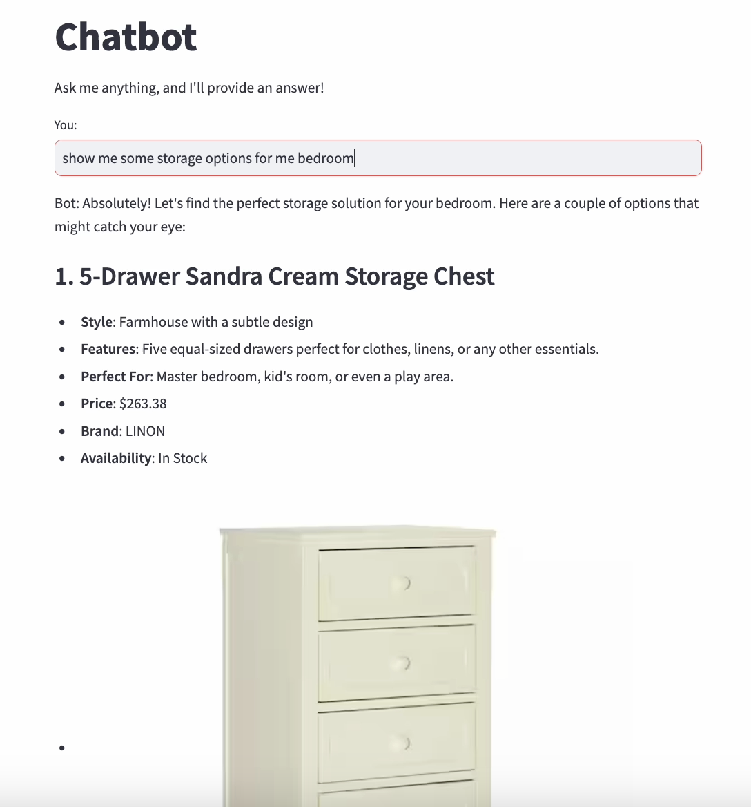
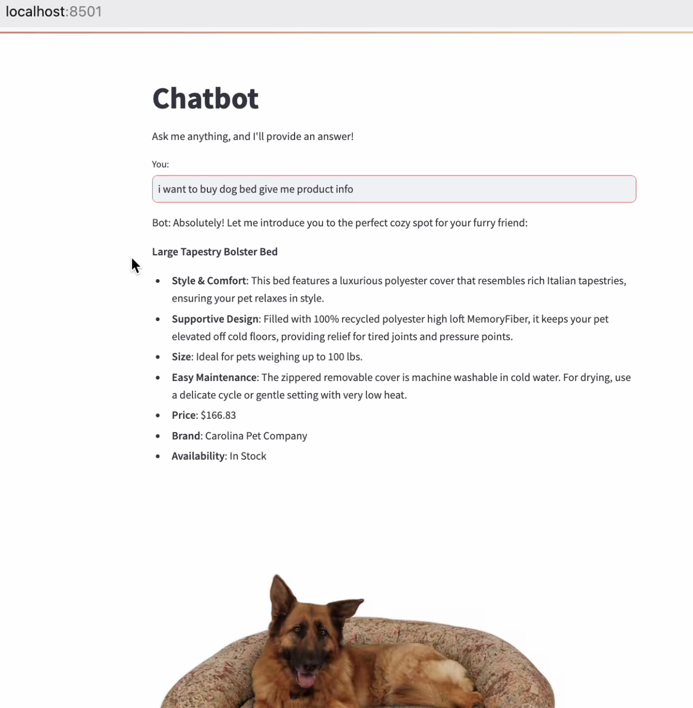

# README: RAG-based Chatbot for Product Recommendations

This repository provides a robust implementation of a Retrieval-Augmented Generation (RAG)-based chatbot designed to answer user queries about Home Depot products. The RAG system combines preprocessed product data with an OpenAI-powered chatbot to generate accurate, context-aware responses. The bot retrieves relevant product details, images, and additional context from a Chroma vector store powered by OpenCLIP embeddings.






## Installation

### Step 1: Clone the repository
```bash
git clone https://github.com/your-username/multimodal_rag.git
cd multimodal_rag
```

### Step 2: Install dependencies
Use `pip` to install the necessary dependencies:

```bash
pip install -r requirements.txt
```

This will install all required libraries, including `langchain`, `Chroma`, `open_clip_torch`, `torch`, and others.

### Step 3: Set up OpenAI API key
Create an `.env` file and add your OpenAI API key:

```env
OPENAI_API_KEY=your-api-key-here
```

## Dependencies

- `langchain`
- `langchain-chroma`
- `langchain-experimental`
- `openai`
- `numpy`
- `open_clip_torch`
- `Pillow`
- `pandas`
- `requests`
- `torch`
- `transformers`

## Project Structure

```bash
rag-chatbot/
│
├── create_rag.py         # RAG system creation and retriever setup
├── data_preprocessing.py # Data preprocessing pipeline for images and text
├── process_img_response.py # Image processing utilities
├── app.py                # Streamlit-based UI for chatbot interaction
├── requirements.txt      # List of project dependencies
└── README.md             # This file
```

- `create_rag.py`: This script initializes the Chroma vector store and sets up the RAG pipeline.
- `data_preprocessing.py`: Contains the `DataPreprocessor` class that processes product data.
- `process_img_response.py`: Includes utility functions for handling images and base64 encoding.
- `app.py`: The main Streamlit app for interacting with the chatbot.

## Usage

1. **Prepare Data**: 
   - The data for products should be in a CSV file, which will be processed by the `DataPreprocessor` class.

2. **Run the Streamlit app**: 
